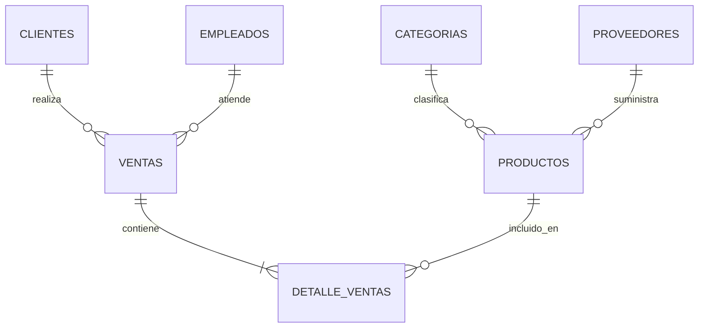

# Proyecto 3 - Seguridad, Roles y Stored Procedures

**CC3088 - Bases de Datos 1 - Universidad del Valle de Guatemala - Ciclo 1, 2026**

Extension del Proyecto 2: gestion de inventario y ventas con seguridad a nivel de DBMS mediante 5 roles con GRANT/REVOKE, 6 stored procedures y ORM con Sequelize.

Stack: PostgreSQL 16 + Node.js (Express + Sequelize) + React (Vite) + Docker Compose.

## Levantar el proyecto

```bash
cp .env.example .env
docker compose up --build
```

Si ya existe un volumen de PostgreSQL del Proyecto 2, reiniciar la base para que se ejecuten los nuevos scripts:

```bash
docker compose down -v
docker compose up --build
```

Abrir http://localhost:3000

## Credenciales

| Servicio | Usuario | Contrasena |
| --- | --- | --- |
| Base de datos | proy3 | secret |
| Admin UI | admin_user | admin123 |

## Usuarios de prueba por rol

| Username | Contrasena | Rol | Permisos principales |
| --- | --- | --- | --- |
| admin_user | admin123 | administrador | Acceso total |
| gerente_user | admin123 | gerente | Todo excepto eliminar ventas |
| cajero_user | admin123 | cajero | Registrar ventas, ver productos y clientes |
| bodeguero_user | admin123 | bodeguero | Gestionar stock de productos |
| cliente_user | admin123 | cliente_web | Solo lectura del catalogo de productos |

## Esquema de roles (DBMS)

| Rol | Tablas con acceso | Operaciones |
| --- | --- | --- |
| administrador | Todas | SELECT, INSERT, UPDATE, DELETE |
| gerente | Todas | SELECT total; INSERT/UPDATE en ventas, productos, clientes, empleados |
| cajero | productos, categorias, proveedores, clientes, empleados, ventas, detalle_ventas | SELECT + INSERT en ventas; UPDATE stock en productos |
| bodeguero | productos, categorias, proveedores | SELECT, INSERT, UPDATE |
| cliente_web | productos, categorias | SELECT unicamente |

## Stored Procedures

| Procedimiento | Descripcion | IN/OUT | Transaccion |
| --- | --- | --- | --- |
| `registrar_venta` | Registra una venta completa con validacion de stock | Si | ROLLBACK por bloque de excepcion |
| `actualizar_stock` | Actualiza stock de un producto con validacion | Si | No |
| `crear_producto` | Inserta producto nuevo con validaciones | Si | No |
| `crear_cliente` | Inserta cliente con manejo de email duplicado | Si | No |
| `obtener_resumen_ventas` | Retorna KPIs: total ventas, ingresos del mes y producto top | Si | No |
| `eliminar_cliente_seguro` | Elimina cliente solo si no tiene ventas asociadas | Si | No |

## ORM (Sequelize)

- `GET /api/productos` usa `Producto.findAll()` con includes de Categoria y Proveedor.
- `PUT /api/productos/:id` usa `Producto.update()`.
- `DELETE /api/productos/:id` usa `Producto.destroy()`.
- `GET /api/clientes` usa `Cliente.findAll()`.
- `PUT /api/clientes/:id` usa `Cliente.update()`.

## Servicios

- Frontend: http://localhost:3000
- Backend API: http://localhost:4000
- PostgreSQL: localhost:5432

## Estructura

```text
.
|-- docker-compose.yml
|-- .env.example
|-- db/
|   |-- 01_ddl.sql
|   |-- 02_seed.sql
|   |-- 03_views_indexes.sql
|   |-- 04_roles.sql
|   |-- 05_usuarios_prueba.sql
|   `-- 06_stored_procedures.sql
|-- backend/
|   |-- Dockerfile
|   |-- package.json
|   `-- src/
|       |-- index.js
|       |-- db.js
|       |-- db-sequelize.js
|       |-- models/
|       |   `-- index.js
|       |-- middleware/
|       |   `-- auth.js
|       `-- routes/
`-- frontend/
    |-- Dockerfile
    |-- package.json
    `-- src/
        |-- auth.js
        |-- App.jsx
        |-- components/
        |   |-- Navbar.jsx
        |   `-- ProtectedRoute.jsx
        `-- pages/
```

## Diagrama ER



## Autor

**Adrian Penagos - 24914**  
Universidad del Valle de Guatemala  
CC3088 - Bases de Datos 1 - Ciclo 1, 2026
