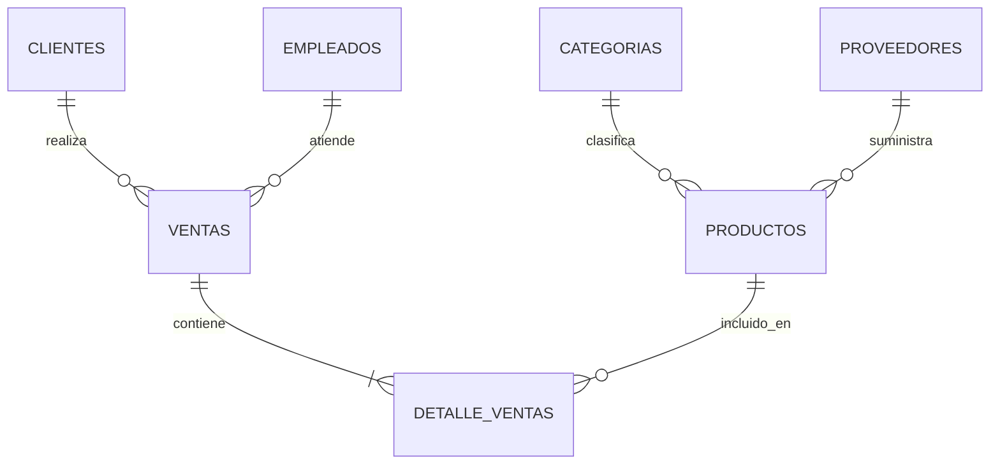

# Proyecto 2 — Gestión de Inventario y Ventas
**CC3088 · Bases de Datos 1 · Universidad del Valle de Guatemala · Ciclo 1, 2026**

Aplicación web full-stack para una tienda: catálogo de productos, clientes, registro de ventas con control de stock transaccional, reportes y autenticación.

Stack: PostgreSQL 16 + Node.js (Express) + React (Vite) — orquestado con Docker Compose.

## Levantando el proyecto

1. Clonar el repositorio
2. Copiar `.env.example` a `.env`
3. Ejecutar:

    docker compose up --build

4. Abrir http://localhost:3000

## Credenciales de base de datos
- Usuario: proy2
- Contraseña: secret
- Base de datos: tienda_db

## Usuario de prueba (login)
- Username: admin
- Password: admin123

## Servicios
- Frontend: http://localhost:3000
- Backend API: http://localhost:4000
- PostgreSQL: localhost:5432

## Diagrama ER



## Estructura

```
.
├── docker-compose.yml
├── .env / .env.example
├── db/
│   ├── 01_ddl.sql
│   ├── 02_seed.sql
│   └── 03_views_indexes.sql
├── backend/
│   ├── Dockerfile
│   ├── package.json
│   └── src/
│       ├── index.js
│       ├── db.js
│       ├── middleware/auth.js
│       └── routes/
└── frontend/
    ├── Dockerfile
    ├── package.json
    └── src/
        ├── pages/
        └── components/
```

## Autor

**Adrian Penagos — 24914**
Universidad del Valle de Guatemala
CC3088 — Bases de Datos 1 · Ciclo 1, 2026
